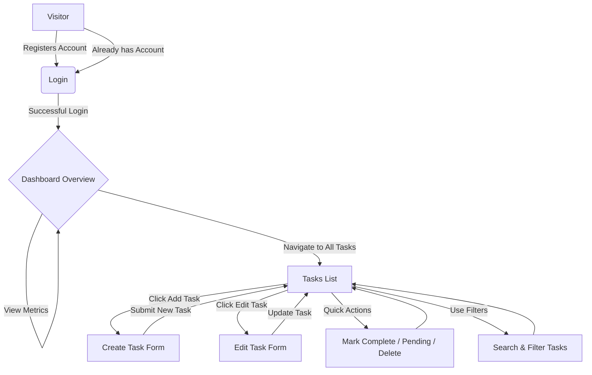
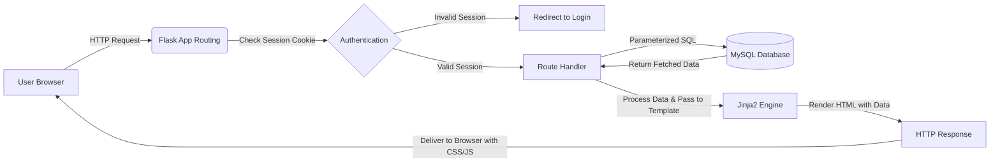

# Task Management System

A full-stack Task Management System built with Python (Flask), MySQL, and Vanilla HTML/CSS/JavaScript. It features a clean architecture, simple folder structure, and well-commented code, making it perfect for beginners.

## Features

- **User Authentication:** Registration, login, and logout using session-based authentication with secure password hashing.
- **Dashboard Overview:** Quick statistics showing total, pending, completed, and overdue tasks.
- **Task Management:** Full CRUD (Create, Read, Update, Delete) operations for tasks.
- **Task Filtering & Search:** Filter tasks by status and priority, and search by title.
- **Clean UI:** Modern, responsive, card-based interface built completely without CSS frameworks like Bootstrap or Tailwind.
- **Security:** Parameterized SQL queries to prevent SQL injection and hashed passwords (Werkzeug).

## Workflows

### User Workflow



### System Workflow



## Folder Structure

```text
task_manager/
│
├── app.py                 # Main Flask application and routing logic
├── config.py              # Configuration settings (database credentials)
├── requirements.txt       # Python dependencies (Flask, mysql-connector-python)
│
├── database/
│   └── schema.sql         # SQL script to create the necessary tables
│
├── static/
│   ├── css/
│   │   └── style.css      # Vanilla CSS styling
│   └── js/
│       └── main.js        # Vanilla JS for frontend interactions
│
├── templates/
│   ├── base.html          # Base Jinja2 template with navbar and layout
│   ├── login.html         # User login page
│   ├── register.html      # User registration page
│   ├── dashboard.html     # Dashboard metrics page
│   ├── tasks.html         # Tasks list, filter, and search
│   ├── add_task.html      # Form to create a new task
│   └── edit_task.html     # Form to edit an existing task
│
└── README.md              # Project documentation
```

## Installation & Setup

Follow these steps to get the project running locally.

### 1. Prerequisites

- Python 3.x
- MySQL Server

### 2. Clone the Repository

```bash
git clone <repository-url>
cd "Task Management System"
```

### 3. MySQL Setup & Database Import

1. Start your local MySQL server (e.g., via XAMPP, WAMP, or standalone MySQL).
2. Open your MySQL client (Command Line, phpMyAdmin, or MySQL Workbench).
3. Import the database schema from the `database/schema.sql` file.

From the command line, you can do:
```bash
mysql -u root -p < database/schema.sql
```
*(This creates a database named `task_manager` with `users` and `tasks` tables).*

### 4. Configuration

Open `config.py` in the root folder and update the MySQL credentials to match your local setup:

```python
class Config:
    SECRET_KEY = 'your-secret-key' # Change this in production
    MYSQL_HOST = 'localhost'
    MYSQL_USER = 'root'            # Your MySQL username
    MYSQL_PASSWORD = ''            # Your MySQL password
    MYSQL_DATABASE = 'task_manager'
```

### 5. Install Python Dependencies

Create a virtual environment (optional but recommended) and install the required packages:

```bash
# Create virtual environment (Windows)
python -m venv venv
venv\Scripts\activate

# Install dependencies
pip install -r requirements.txt
```

### 6. Run the Flask Application

Start the development server:

```bash
python app.py
```

The application will run at `http://127.0.0.1:5000/`. Open this URL in your web browser.

---

## Screenshots


- **Login / Register**
  
  
- **Dashboard**
  
- **Task List**
  
- **Add Task**
  
  
---

## Future Improvements

- Implement pagination for the tasks list.
- Add user profile management (avatar, update password).
- Implement email notifications for overdue tasks.
- Allow grouping tasks into categories or projects.
- Add drag-and-drop ordering for tasks.

## 📄 License

This project is intended for educational and learning purposes.

---

## 👩‍💻 Author

**Aarushi Chaddha**

---

## 🏢 Internship

**These projects were developed as part of the MPOnline Internship Project.**

